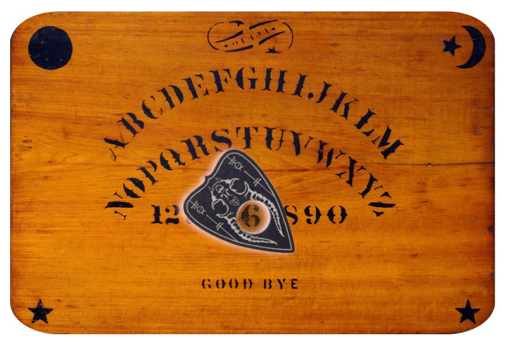

## Ouija Online

A web horror experience where you communicate with spirits using a Ouija board.

Try it here: :scream: :scream: :scream: [https://ouija.attejuvonen.fi](https://ouija.attejuvonen.fi) :scream: :scream: :scream:

#### Notable features:

- Despite existing only as a web page, the spirits have the ability to __move the player's mouse__ towards letters on the board.
- Two different chatbots available: a __scripted experience__ is available for all, and for players who have OpenAI API keys, there is a more versatile __GPT-3 mode__.
- Questline for the scripted experience has two potential endings. (TODO)
- Contains a fun easter egg! Can you find it?

#### How does it work

- Ouija Online is built as a static website with vanilla JS, HTML, and CSS. No frameworks, no libraries, no generators, no bundlers, no servers. You can fork this repo and simply open `index.html` in your browser.
- We use WebRTCSeanceChannel to communicate with the spirit world.
- Control of the user's mouse is achieved via spirits, which merely accelerate and decelerate mouse movements (to make the user feel as if no-one else is moving the mouse except them).
- Chatbot in scripted mode utilizes state-of-the-art if-else technology.
- Chatbot in GPT-3 mode constructs a prompt with verbal instructions, question-answer examples, previous question and answer, and current question. We request 5 completions for the prompt, and then heuristically choose one of them (considering length, repetition, dullness, etc.).

#### Attribution

Design and implementation: [Baobab Koodaa](https://github.com/baobabKoodaa)

Assets and effects:

- The particular Ouija board used here is the original Ouija board from 1889, created by Kennard Novelty Company. The JPG image of the board is from [Wikipedia](https://en.wikipedia.org/wiki/Ouija#/media/File:Ouija_board_-_Kennard_Novelty_Company.png), which states that it is in the public domain. Photographer is unknown.
- Planchette PNG image is from [KindPNG](https://www.kindpng.com/imgv/hToiomo_transparent-planchette-png-ouija-board-planchette-png-png/), which provide permission for use in "non-commercial or personal projects". Author is unknown.
- Smoke effect used in tooltip is adapted from work by [chokcoco](https://segmentfault.com/a/1190000041189786/en). I modified the effect heavily in order to get smoother transitions for dissipation and hover. Those transitions now animate the Perlin turbulence filter by using SVG animate (not CSS!) in addition to some CSS transitions.
- Text glitch effect used in spirit message was popularized by Tiktok and implementation is adapted from [AmazingCSS](https://amazingcss.com/glitch-text-effect-like-tiktok/).
- Magnifying glass effect adapted from [W3Schools](https://www.w3schools.com/howto/howto_js_image_magnifier_glass.asp) example code.
- Font 'Feral' was created by Marcus Lien Gundersen and was downloaded from [1001fonts](https://www.1001fonts.com/feral-font.html), which provide permission for both personal and commercial use.
- Font 'Carnevalee Freakshow' was created by Chris Hansen and was downloaded from [1001fonts](https://www.1001fonts.com/carnivalee-freakshow-font.html), which provide permission for both personal and commercial use.
- Font 'Kingthings Trypewriter 2' was created by Kevin King and was downloaded from [1001fonts](https://www.1001fonts.com/kingthings-trypewriter-2-font.html), which provide permission for both personal and commercial use.
- Background pattern used in first-visit popup is from [Hero Patterns](https://heropatterns.com/), which provide permission for use under CC BY 4.0 license.
- Icons for settings and external links are from [FontAwesome](https://fontawesome.com/icons/gear?s=solid) with permission for both personal and commercial use.
- Creepy old photo used in easter egg is from [Vintage Everyday](https://www.vintag.es/2016/11/these-50-creepy-photographs-early-20th.html), copyright expired.